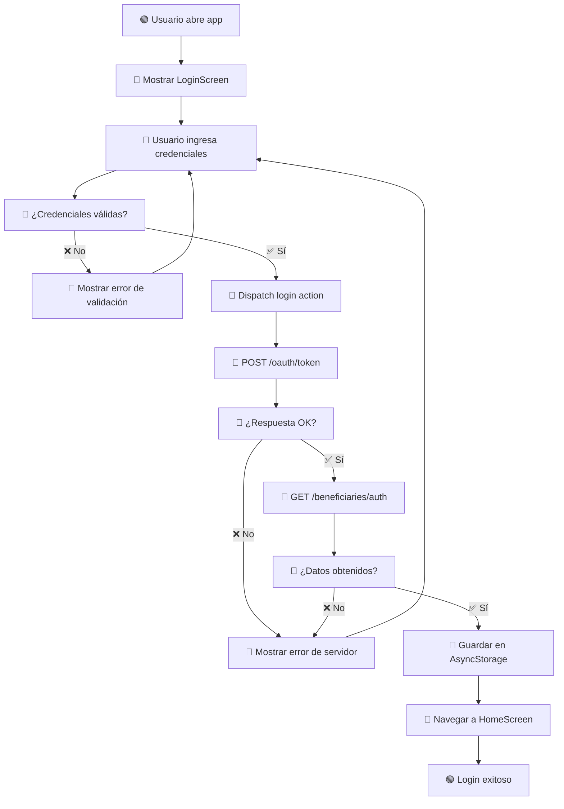
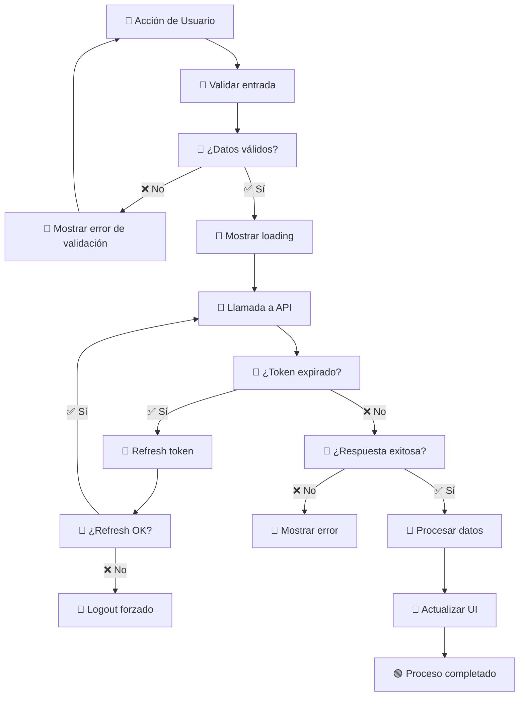
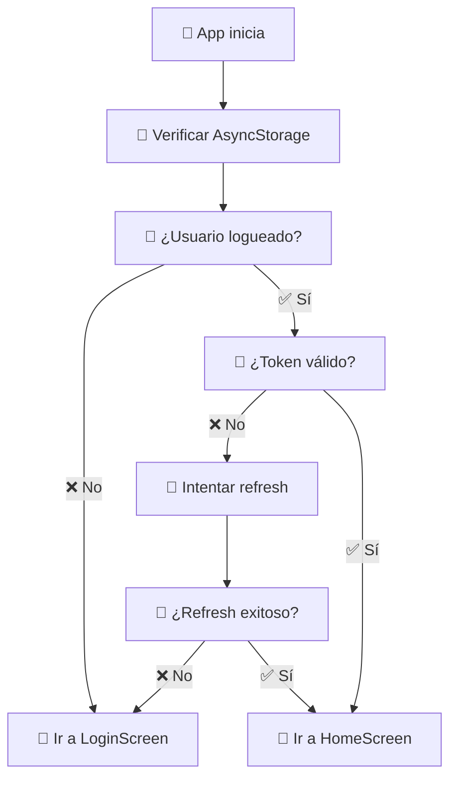
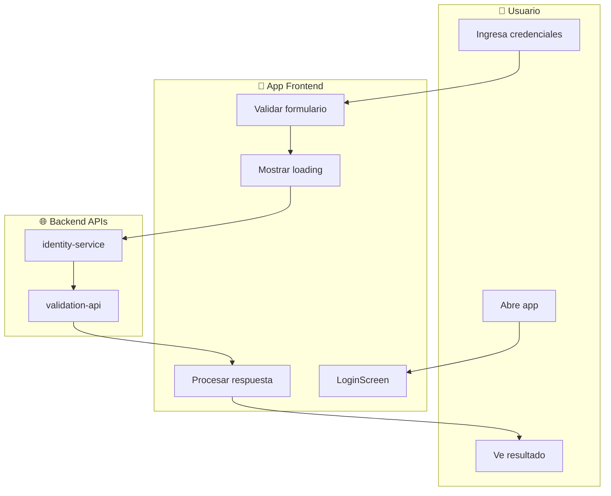

# 📊 **Guía para Crear Flujogramas - App Beneficiario IPROSS**

## 🎯 **Introducción**

Esta guía te ayudará a crear flujogramas efectivos para documentar los procesos y flujos de la aplicación móvil de beneficiarios IPROSS.

---

## 🛠 **Herramientas Recomendadas**

### **Gratuitas:**
- **Lucidchart** (versión gratuita)
- **Draw.io** (ahora diagrams.net) - 100% gratuito
- **Miro** (versión gratuita)
- **Creately** (versión gratuita limitada)

### **De Pago:**
- **Visio** (Microsoft)
- **OmniGraffle** (Mac)
- **Lucidchart Pro**

### **Para Desarrolladores:**
- **Mermaid** (markdown/código)
- **PlantUML** (texto a diagramas)

---

## 📋 **Elementos Básicos de Flujogramas**

### **Símbolos Estándar:**

```
🟢 [Inicio/Fin]          - Óvalos verdes
📱 [Proceso/Acción]      - Rectángulos azules  
💎 [Decisión]            - Rombos naranjas
📄 [Documento/Datos]     - Rectángulos con base ondulada
⚡ [Conector]            - Círculos pequeños
🔄 [Subproceso]          - Rectángulos con doble borde
⏳ [Espera/Delay]        - Rectángulos redondeados
```

### **Códigos de Color:**
- **Verde**: Inicio, éxito, completado
- **Azul**: Procesos normales, acciones de usuario
- **Naranja**: Decisiones, validaciones
- **Rojo**: Errores, fallos, cancelaciones
- **Gris**: Procesos en background, sistemas externos

---

## 🔄 **Flujograma Principal: Proceso de Login**

### **Plantilla Básica:**



---

## 📱 **Flujogramas por Funcionalidad**

### **1. Flujo de Autenticación Completo**

**Elementos a incluir:**
- Validación de formularios (Yup)
- Estados de loading
- Manejo de errores
- Refresh token automático
- Navegación condicional

### **2. Flujo de Registro de Usuario**

**Elementos a incluir:**
- Validación de datos personales
- Verificación de email
- Términos y condiciones
- Confirmación de registro

### **3. Flujo de Recuperación de Contraseña**

**Elementos a inclurar:**
- Validación de email/username
- Envío de código
- Verificación de código
- Cambio de contraseña

---

## 🎨 **Plantillas Específicas para la App**

### **Plantilla: Interacción con API**



### **Plantilla: Navegación Condicional**



---

## 📝 **Mejores Prácticas**

### **1. Estructura y Organización**

- **Flujo de arriba hacia abajo**
- **Usar lanes (carriles) para separar actores**:
  - Usuario
  - App Frontend  
  - Backend APIs
  - Sistemas externos

### **2. Nivel de Detalle**

- **Alto nivel**: Para stakeholders y overview
- **Detallado**: Para desarrolladores e implementación
- **Técnico**: Para debugging y troubleshooting

### **3. Nomenclatura Clara**

```
✅ BIEN: "Usuario ingresa email y contraseña"
❌ MAL: "Login"

✅ BIEN: "POST /identity-service/v1/oauth/token"  
❌ MAL: "Llamar API"

✅ BIEN: "¿Código de respuesta 200?"
❌ MAL: "¿Todo OK?"
```

### **4. Estados y Transiciones**

- Incluir todos los estados posibles
- Mostrar transiciones de error
- Documentar estados de loading
- Incluir timeouts y reintentos

---

## 🏗 **Plantilla de Lanes (Carriles)**



---

## 📊 **Ejemplo Completo: Flujo de Autorizaciones**

```mermaid
flowchart TD
    subgraph "👤 Usuario"
        A[Selecciona "Solicitar Autorización"]
        B[Completa formulario]
        C[Confirma envío]
        D[Ve estado de solicitud]
    end
    
    subgraph "📱 App"
        E[AuthorizationScreen]
        F[Validar datos]
        G[Mostrar loading]
        H[POST /authorizations]
        I[Actualizar UI]
        J[Navegar a tracking]
    end
    
    subgraph "🌐 validation-api"
        K[Recibir solicitud]
        L[Validar beneficiario]
        M[Crear autorización]
        N[Retornar ID]
    end
    
    subgraph "🏥 Sistema IPROSS"
        O[Procesar solicitud]
        P[Evaluar cobertura]
        Q[Aprobar/Rechazar]
    end
    
    A --> E
    B --> F
    F --> |❌ Error| B
    F --> |✅ OK| G
    C --> H
    H --> K
    K --> L
    L --> M
    M --> N
    N --> I
    I --> J
    J --> D
    
    O --> P
    P --> Q
    Q --> |Actualización| I
```

---

## 🎯 **Checklist para Flujogramas Efectivos**

### **Antes de Crear:**
- [ ] Definir objetivo del flujograma
- [ ] Identificar actores principales
- [ ] Determinar nivel de detalle necesario
- [ ] Elegir herramienta apropiada

### **Durante la Creación:**
- [ ] Usar símbolos estándar
- [ ] Mantener consistencia en colores
- [ ] Incluir todos los caminos posibles
- [ ] Documentar decisiones y validaciones
- [ ] Agregar estados de error

### **Después de Crear:**
- [ ] Revisar con el equipo
- [ ] Validar contra implementación actual
- [ ] Actualizar documentación relacionada
- [ ] Versionar y compartir

---

## 📚 **Recursos Adicionales**

### **Templates Descargables:**
- Template Lucidchart para apps móviles
- Símbolos estándar de flujogramas
- Paleta de colores para diferentes tipos de proceso

### **Ejemplos de la Industria:**
- Flujos de autenticación OAuth2
- Patrones de UX para apps móviles
- Diagramas de arquitectura de microservicios

### **Documentación Técnica:**
- Estándares ISO para diagramas de flujo
- Notación BPMN para procesos de negocio
- UML para diagramas de actividad

---

**📅 Fecha**: 3 de octubre de 2025  
**👨‍💻 Autor**: Equipo de Desarrollo IPROSS  
**📱 App**: Beneficiario IPROSS v1.3.2